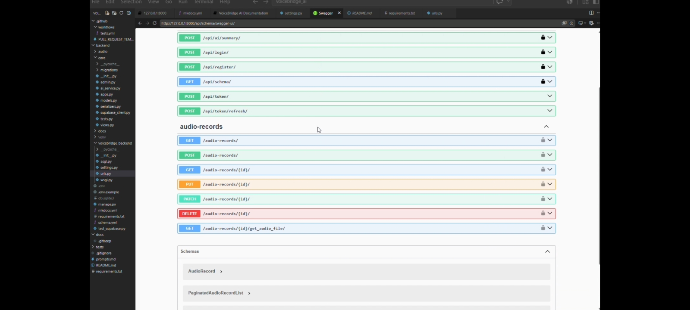
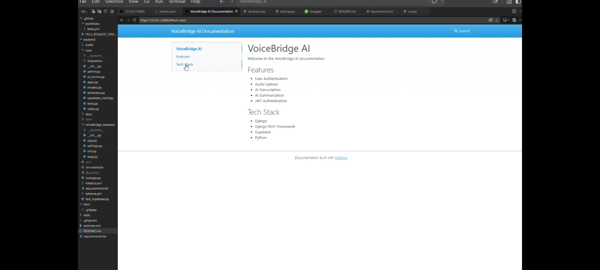
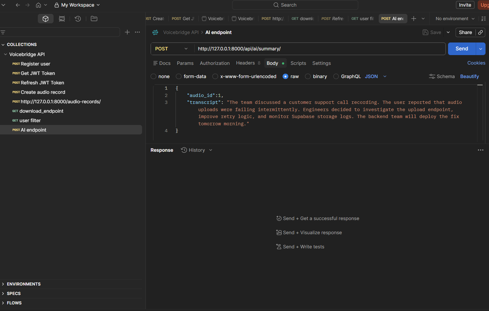
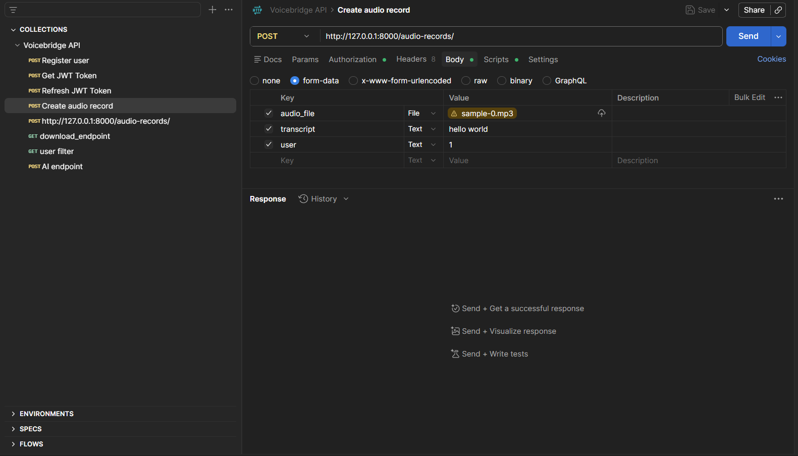
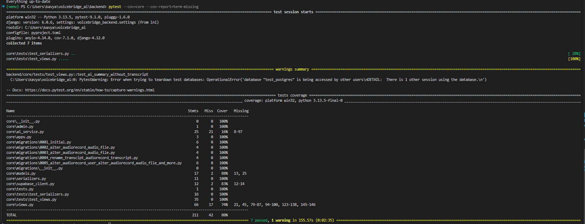
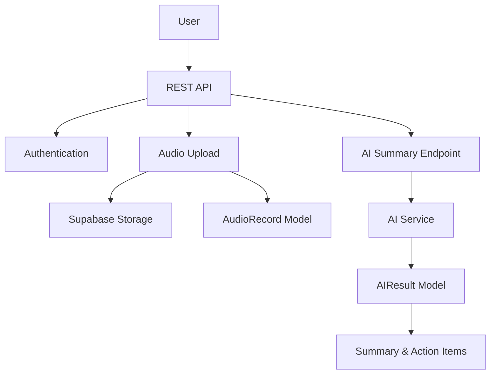

# 🎙️ VoiceBridge AI

VoiceBridge AI is an AI-powered speech assistant built using Django REST Framework. Users can upload audio recordings and receive accurate transcripts, concise AI-generated summaries, and extracted action items. The project is designed to improve accessibility and productivity by transforming spoken content into structured text.

---

## 🚀 Features

- 🔐 User Registration & JWT Authentication
- 🎤 Audio Upload API
- 📝 Automatic Speech-to-Text Transcription
- 🤖 AI-Powered Summarization
- ✅ Action Item Extraction
- 💾 Store Records in Database
- 📚 Interactive Swagger/OpenAPI Documentation
- 🔄 Secure REST APIs using Django REST Framework

---

## 🛠️ Tech Stack

- Python 3
- Django
- Django REST Framework
- JWT Authentication (`simplejwt`)
- drf-spectacular (Swagger/OpenAPI)
- Supabase (for data storage)
- AI Model Integration (Gemini/OpenAI compatible)
- SQLite (development)

---

## 📂 Project Structure

```
backend/
│── core/
│── audio/
│── voicebridge_backend/
│── manage.py
│── requirements.txt
```

---

## ⚙️ Installation

Clone the repository:

```bash
git clone https://github.com/kavyaajo/voicebridge_ai.git
cd voicebridge_ai
```

Create a virtual environment:

```bash
python -m venv venv
```

Activate it:

Windows

```bash
venv\Scripts\activate
```

Linux/macOS

```bash
source venv/bin/activate
```

Install dependencies:

```bash
pip install -r requirements.txt
```

Run migrations:

```bash
python manage.py migrate
```

Start the server:

```bash
python manage.py runserver
```

---

## 📖 API Documentation

Swagger UI:

```
http://127.0.0.1:8000/api/schema/swagger-ui/
```

OpenAPI Schema:

```
http://127.0.0.1:8000/api/schema/
```

---

## 🔄 Workflow

```
Start
   │
   ▼
Login / Register
   │
   ▼
Home Dashboard
   │
   ▼
Upload Audio
   │
   ▼
Generate Transcript
   │
   ▼
AI Summarization
   │
   ▼
Extract Action Items
   │
   ▼
Save Results
   │
   ▼
Display Summary
   │
   ▼
Complete
```

---

## 🔗 Main API Endpoints

| Method | Endpoint | Description |
|---------|----------|-------------|
| POST | `/api/register/` | Register a new user |
| POST | `/api/login/` | User login |
| POST | `/api/token/` | Obtain JWT token |
| POST | `/api/token/refresh/` | Refresh JWT token |
| POST | `/api/ai/summary/` | Generate AI summary |
| GET | `/audio-records/` | List audio records |
| POST | `/audio-records/` | Upload new audio |

---

## 🧪 Testing

Run tests with:

```bash
python manage.py test
```
# or
pytest


## 📸 Screenshots

### Swagger UI


### MkDocs Documentation


### AI Summary API


### Audio Upload API


### Test Coverage



## Live Demo
Deployment in progress. URL will be added soon.


## Contributing
Please see `CONTRIBUTING.md` for guidelines on contributing to this project.

## 🔗 Postman Collection

The exported Postman collection is available in this repository as `Voicebridge_API.postman_collection`.

## 🏗️ Architecture Diagram

