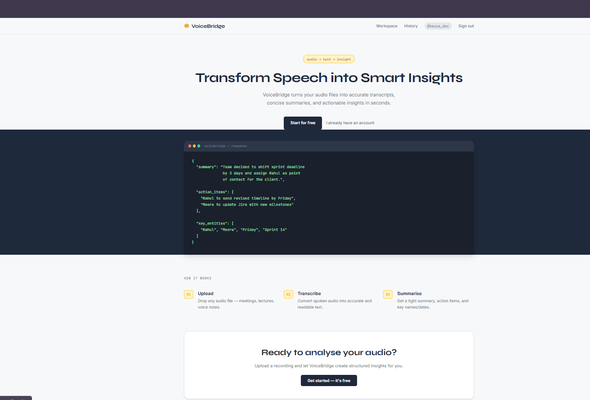
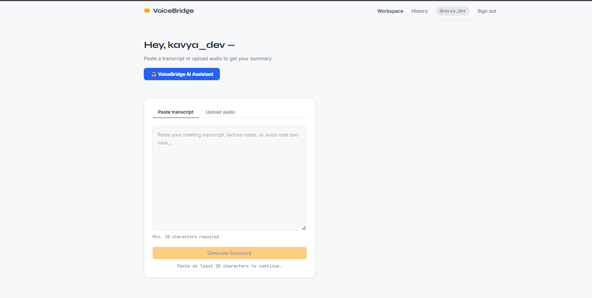
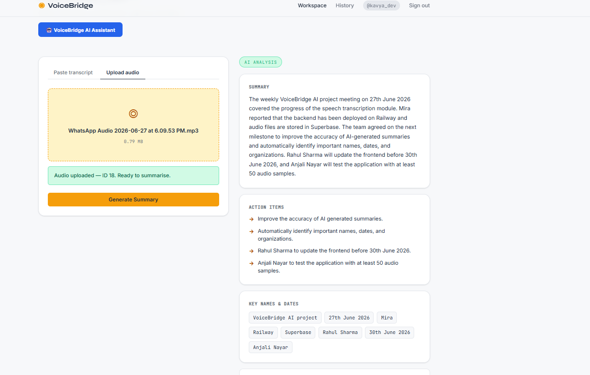
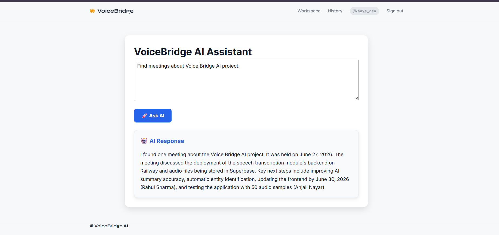
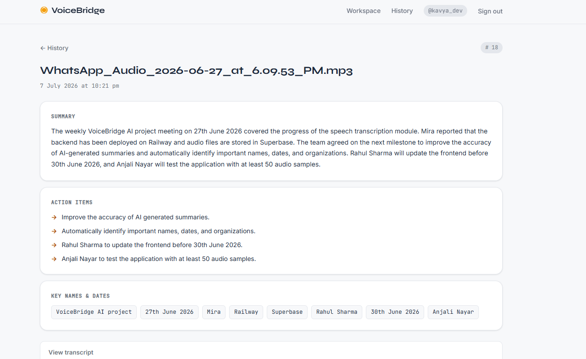
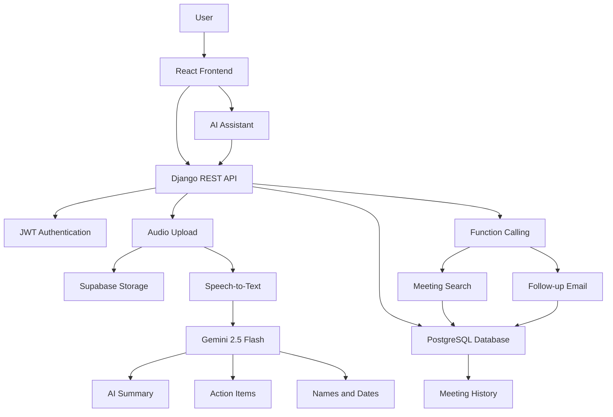

# 🎙️ VoiceBridge AI


 

VoiceBridge AI is an AI-powered meeting assistant that helps users transform meeting audio or transcripts into structured insights. The platform generates AI-powered summaries, extracts action items and important names/dates, stores meeting history, and includes an intelligent AI Assistant capable of searching previous meetings and generating professional follow-up emails using Gemini Function Calling.

---

## 🚀 Features

### Authentication
- JWT Authentication
- User Login & Registration

### Meeting Processing
- Upload Meeting Audio
- Paste Meeting Transcript
- Speech-to-Text Transcription
- AI Meeting Summary
- Action Item Extraction
- Important Names & Dates Extraction

### Meeting History
- Store Previous Meetings
- View Meeting Details
- Search Past Meetings

### AI Assistant
- Search previous meetings using natural language
- Generate professional follow-up emails
- Gemini Function Calling

### Deployment
- Railway Backend
- Vercel Frontend

---

## 🛠️ Tech Stack

Frontend
- React
- Vite
- Axios
- React Router

Backend
- Python
- Django
- Django REST Framework

Authentication
- JWT

Database
- PostgreSQL

Storage
- Supabase

AI
- Google Gemini 2.5 Flash
- Gemini Function Calling

Deployment
- Railway
- Vercel

---

## 📂 Project Structure

```text
voicebridge_ai/
│
├── frontend/
│   ├── src/
│   │   ├── components/
│   │   ├── pages/
│   │   ├── services/
│   │   ├── context/
│   │   ├── App.jsx
│   │   └── main.jsx
│   ├── public/
│   └── package.json
│
├── backend/
│   ├── core/
│   │   ├── views.py
│   │   ├── serializers.py
│   │   ├── models.py
│   │   ├── agent_service.py
│   │   ├── agent_tools.py
│   │   └── function_declarations.py
│   ├── voicebridge_backend/
│   ├── manage.py
│   └── requirements.txt
│
├── docs/
└── README.md
```

## ⚙️ Installation

### 1. Clone the Repository

```bash
git clone https://github.com/kavyaajo/voicebridge_ai.git
cd voicebridge_ai
```

---

## 🖥️ Backend Setup

Navigate to the backend directory:

```bash
cd backend
```

Create a virtual environment:

```bash
python -m venv venv
```

Activate the virtual environment:

**Windows**

```bash
venv\Scripts\activate
```

**Linux/macOS**

```bash
source venv/bin/activate
```

Install dependencies:

```bash
pip install -r requirements.txt
```

Run database migrations:

```bash
python manage.py migrate
```

Start the Django development server:

```bash
python manage.py runserver
```

The backend will be available at:

```
http://127.0.0.1:8000
```

---

## 🌐 Frontend Setup

Open a new terminal and navigate to the frontend directory:

```bash
cd frontend
```

Install dependencies:

```bash
npm install
```

Start the React development server:

```bash
npm run dev
```

The frontend will be available at:

```
http://localhost:5173
```

## 📖 API Documentation & Live Demo

### 🌐 Frontend (Live Demo)

https://voicebridge-ai-mu.vercel.app

---

### ⚙️ Backend API

https://voicebridgeai-production.up.railway.app

---

### 📚 Swagger UI

**Local**

```text
http://127.0.0.1:8000/api/schema/swagger-ui/
```

**Production**

```text
https://voicebridgeai-production.up.railway.app/api/schema/swagger-ui/
```

---

### 📄 OpenAPI Schema

**Local**

```text
http://127.0.0.1:8000/api/schema/
```

**Production**

```text
https://voicebridgeai-production.up.railway.app/api/schema/
```

---

## 🔄 Workflow

```
User Login

↓

Workspace

↓

Upload Audio / Paste Transcript

↓

Speech-to-Text

↓

AI Summary

↓

Extract Action Items

↓

Store Meeting

↓

History

↓

AI Assistant

↓

Search Meetings / Generate Follow-up Email
```

---

## 🔗 Main API Endpoints

| Method | Endpoint | Description |
|---------|----------|-------------|
| POST | `/api/register/` | Register a new user |
| POST | `/api/login/` | Authenticate user |
| POST | `/api/token/` | Obtain JWT access and refresh tokens |
| POST | `/api/token/refresh/` | Refresh JWT access token |
| POST | `/api/ai/summary/` | Generate AI-powered meeting summary |
| POST | `/api/agent/` | Query the AI Assistant (Gemini Function Calling) |
| GET | `/audio-records/` | Retrieve uploaded audio records |
| POST | `/audio-records/` | Upload a new audio recording |
| GET | `/audio-records/{id}/` | Retrieve details of a specific audio record |
| GET | `/audio-records/{id}/get_audio_file/` | Download the uploaded audio file |


---

## 🧪 Testing

The application was tested across both the frontend and backend to ensure reliable functionality.

### Backend Testing

Run the Django test suite:

```bash
python manage.py test
```

or, if using pytest:

```bash
pytest
```

### Manual Functional Testing

The following features were verified:

- ✅ User Registration & Login
- ✅ JWT Authentication
- ✅ Audio Upload
- ✅ Speech-to-Text Transcription
- ✅ AI-Powered Meeting Summarization
- ✅ Action Item Extraction
- ✅ Important Names & Dates Extraction
- ✅ Meeting History
- ✅ AI Assistant (Gemini Function Calling)
- ✅ Previous Meeting Search
- ✅ Follow-up Email Generation
- ✅ Railway Backend Deployment
- ✅ Vercel Frontend Deployment 


## 📸 Screenshots

### 🏠 Landing Page


### 📊 Dashboard


### 🎤 Audio Upload


### 🤖 AI Summary


### 📜 Meeting History


### Swagger UI


### MkDocs Documentation


### Test Coverage


## Live Demo
Frontend
https://voicebridge-ai-mu.vercel.app

Backend 
https://voicebridgeai-production.up.railway.app

Swagger
https://voicebridgeai-production.up.railway.app/api/schema/swagger-ui/


## Contributing
Please see `CONTRIBUTING.md` for guidelines on contributing to this project.

## 🔗 Postman Collection

The exported Postman collection is available in this repository as `Voicebridge_API.postman_collection`.

## 🏗️ Architecture Diagram



## 🚀 Deployment

VoiceBridge AI is deployed using a modern cloud architecture for scalability and accessibility.

| Service | Platform |
|---------|----------|
| Frontend | Vercel |
| Backend | Railway |
| Database | PostgreSQL |
| File Storage | Supabase Storage |
| AI Model | Google Gemini 2.5 Flash |


## 👨‍💻 Author

**Kavya Ajo**

- GitHub: https://github.com/kavyaajo
- LinkedIn: https://www.linkedin.com/in/kavya-ajo/

If you found this project useful, consider giving it a ⭐ on GitHub.


